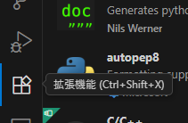
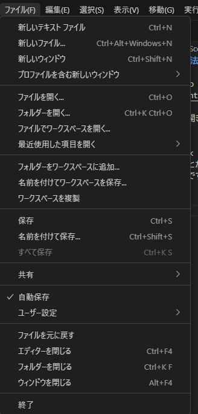
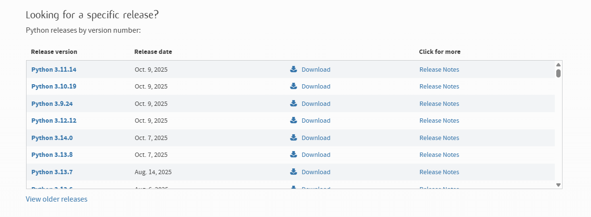
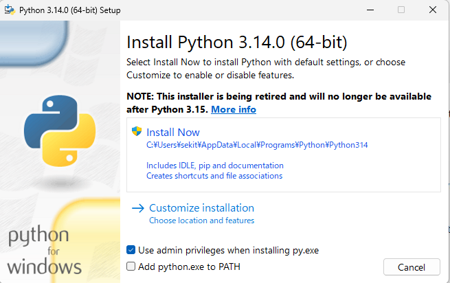
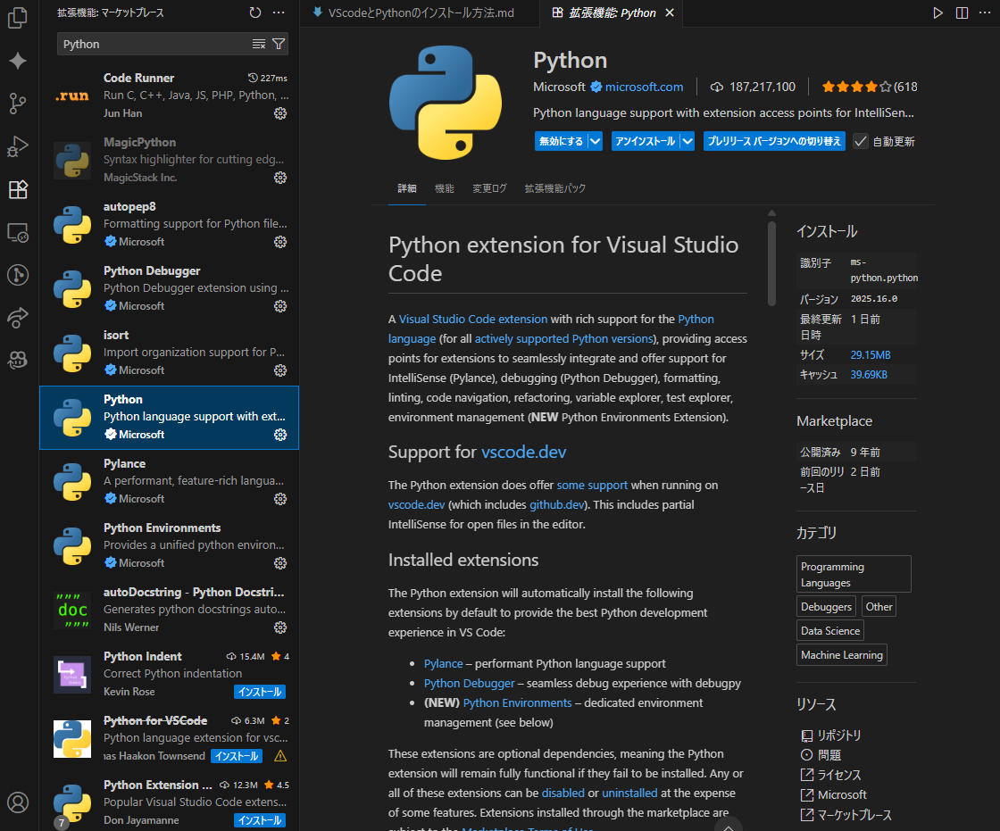

# VScodeとPythonのインストール方法
## VScodeのインストール
以下の公式サイトからVisual Studio Codeのインストーラーをダウンロードしてください。  
[Visual Studio Code公式サイト](https://code.visualstudio.com/)　　

インストールが終了したらVScodeを開き(Ctrl+Shift+X)を押すか以下の画像のような四角が4つある場所をクリックしてください。   
  
検索欄にはJapanese Language Pack for Visual Studio Codeと入力し一番上の物をインストールしてください。そうするとVScodeを日本語化することが出来ます。  
以上でVScodeのインストールは終了です。  

（推奨）自動保存の有効化  
VScodeの上にあるファイル(F)を押し自動保存にチェックを入れるとファイルを更新した際に自動で保存されます。  

## Pythonのインストール
Pythonの公式サイトのダウンロードページからPythonのインストーラーをダウンロードしてください。  
[Pythonの公式サイト](https://www.python.org/)  
[Python公式のダウンロードサイト](https://www.python.org/downloads/)  
Looking for a specific release?から好きなバージョンを選択してダウンロードしてください。  
ここではPython 3.11.x系のバージョンを使用するのでPython 3.11の中で好きなものをダウンロードしてください。  

ダウンロードが終わったらインストーラーを起動してください。  
最初の画面でAdd Python.exe to PATHにチェックを入れてインストールしてください。  
  
インストールが終わったらVScodeを起動しPythonを動かすための拡張機能をインストールします。
  
拡張機能検索欄にPythonと入力し上記の画像のようにmicrosoftが提供しているPythonをインストールしてください。

## うまくインストールできない場合
うまくインストールできない場合はPython Japanが公開しているインストール手順を参考に再度インストールしてみてください。  
[Python Japanインストール手順](https://www.python.jp/python_vscode/windows/index.html)

## Pythonを動かしてみよう
インストールがうまくできたら実際にPythonを動かしてみましょう。  
以下のサイトを参照してPythonを実際に動かしてみてください。  
[Python Japan Pythonの実行方法](https://www.python.jp/python_vscode/windows/run/write_source.html)